  

  
  

 

## Toolkit

| | |
| :--- | :--- |
| **Languages** | TypeScript · JavaScript · HTML · CSS |
| **Stack** | React · Node.js · JSP · MySQL |
| **Tools** | Git · GitHub · VS Code |

 

## Activity

  

